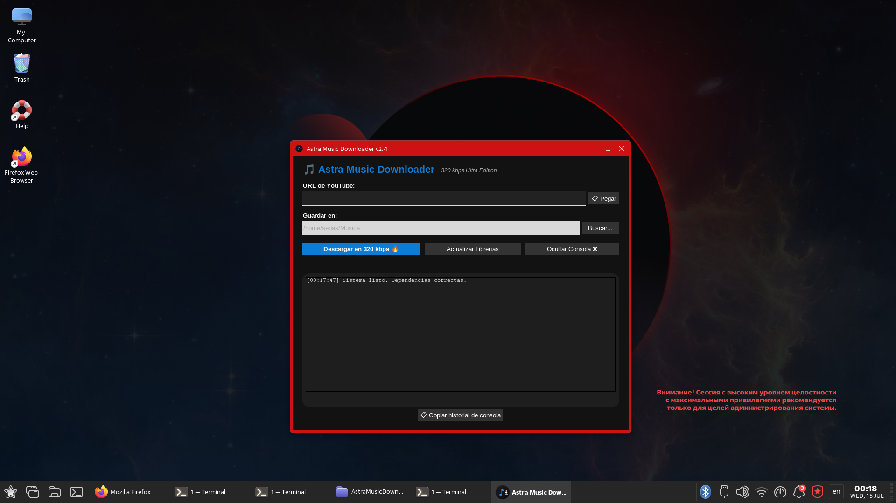

# 🎵 Astra Music Downloader (v2.4)

[](https://astralinux.ru/)
[](https://www.python.org/)
[](LICENSE)

**Astra Music Downloader** es una aplicación de escritorio moderna y ligera diseñada específicamente para sistemas **Astra Linux** (y compatible con Debian/Ubuntu). Permite descargar de forma rápida y sencilla el audio de videos de YouTube convirtiéndolos automáticamente a formato **MP3 con la máxima calidad de sonido (320 kbps)**.

---

## 📸 Capturas de Pantalla

Para que veas la aplicación en acción:

<p align="center">
  
</p>

---

## ✨ Características principales

* **Audio de alta calidad:** Descarga y convierte automáticamente a MP3 a **320 kbps** utilizando el motor de `yt-dlp` y `ffmpeg`.
* **Interfaz de usuario nativa:** Diseñado con una interfaz gráfica limpia, moderna e intuitiva usando Tkinter.
* **Integración total con el sistema:** Incluye un icono personalizado de alta resolución y acceso directo en el menú de aplicaciones de Astra Linux.
* **Fácil instalación:** Empaquetado oficialmente en formato nativo `.deb` para instalar con un solo comando.

---

## 🛠️ Requisitos del sistema

La aplicación se encargará de configurar sus dependencias, pero requiere que tu sistema cuente con:
* **Python 3**
* **FFmpeg** (para la conversión y extracción de audio)
* **yt-dlp**

---

## 🚀 Instalación rápida (.deb)

Para instalar **Astra Music Downloader** en tu sistema usando el paquete precompilado, sigue estos sencillos pasos:

1. Descarga el archivo `.deb` de la última versión desde este repositorio.
2. Abre una terminal en la carpeta donde lo descargaste y ejecuta:

```bash
sudo apt update
sudo apt install ./AstraMusicDownloader_2.4_all.deb